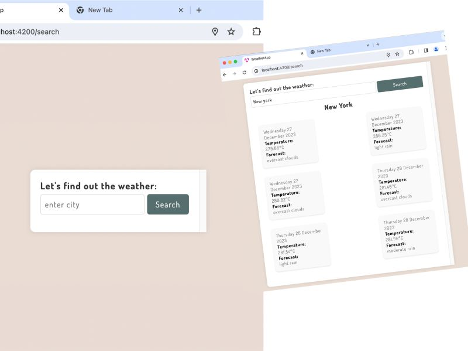
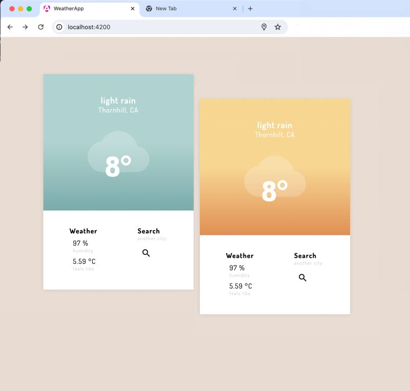

# AngWeatherApp

AngWeatherApp is an Angular and TypeScript-based weather application that leverages API integration to provide users with accurate and up-to-date weather information. The app includes features such as geolocation on the home page and a search functionality that displays long-term forecasts.

# Features

Geolocation on Home Page: The home page of the application uses geolocation to provide users with local weather information as soon as they land on the site.
Search Functionality: Users can enter a location in the search bar to get long-term weather forecasts for that specific area.

# Technologies Used

Angular: A powerful JavaScript framework for building dynamic web applications.
TypeScript: A superset of JavaScript that adds static typing and other features to enhance code quality and development experience.
API Integration: The app integrates with a weather API to fetch and display accurate weather information.
